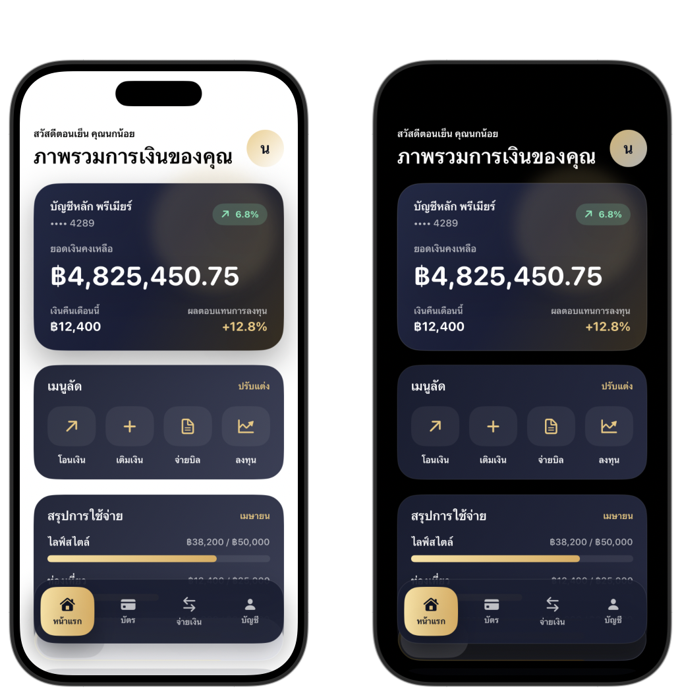

# LuxeBank

Premium-style iOS banking app built with SwiftUI and mock data.

## Screenshots

## Features
- Dashboard
- Cards
- Payments
- Profile

## Tech Stack
- SwiftUI
- MVVM
- Mock Data

## Open in Xcode

Open `LuxeBank.xcodeproj` in Xcode and run the `LuxeBank` scheme on an iPhone simulator.

## Included

- Luxury dashboard UI with gradient surfaces and custom bottom navigation
- Mock account summary, quick actions, spending insights, and transactions
- SwiftUI-only structure with no external dependencies
